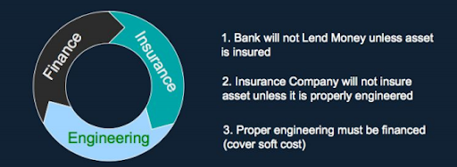

# Subject Outline

**Course Title:** Business Applications of the Original Bitcoin Protocol: A Foundation Course

**Subject Description:** This 12-week foundational course aims to explore the transformative potential of the Original Bitcoin Protocol (OBP) for contemporary business processes. The course introduces students to the core principles of OBP, contrasting it with other blockchain technologies, and showcases its unique business applications. Utilizing real-world case studies, the course delves into how OBP can be utilized to enhance various business processes such as digital transactions, supply chain management, data management, regulatory compliance, large-scale operations, audit processes, B2B and B2C transactions, access management, notarization processes, triple-entry accounting, and EDI and invoicing. Students will develop a critical understanding of OBP and its role in transforming contemporary business landscapes.

**Key Learning Outcomes:** By the end of this course, students will be able to:

1. Understand the core principles and unique features of the Original Bitcoin Protocol.
2. Differentiate between OBP and other blockchain technologies from a business perspective.
3. Understand the regulatory landscape surrounding blockchain technologies and the compliance features of OBP.
4. Understand how OBP can enhance various business processes and operations.
5. Apply their understanding of OBP to evaluate its role in various case studies and real-world scenarios.
6. Understand the implications of OBP's integration with business processes for society at large.

**Week 1 - The Problem that Satoshi Nakamoto Solved**

* Satoshi Nakamoto invented a check valve for data. Computers are very good at copying data, but very bad at not copying data. The Bitcoin database is uniquely a database that can only be changed forward in time, without a central authority, solving the 'Handshake Problem' at scale.
* The Bitcoin database was created as a peer to peer payment system, but can equally well be thought of as a global distributed computer, with its own coding language, similar to Forth, called Bitcoin Script and data storage within 'blocks' in what Satoshi Nakamoto originally described as a 'block chain'.
* 1.7 billion adults globally, and 66% of the Philippines' population of 109 million (72 million) are without access to a bank account. Bitcoin radically lowers the barrier to entry to financial services, anyone with a smartphone can now send and received money globally. [https://www.unbankedmap.org/](https://www.unbankedmap.org/)
* In addition to this, the value, integrity and provenance of much of the data being collected on the internet is subject to Moral Hazard and Adverse Selection. Jaron Lanier coined the term 'Siren Server' to describe how internet users are not the true business customers of platforms like Facebook, Google and so forth and Tristan Harris at the Institute for Humane Technology describes how data and attention hacking can be weaponised against the interests of users for profit. None of this was planned, but it all results from a lack of ability of the internet to solve the handshake problem for data, to allow users to own their data and support micropayments.





* Introduction to the Original Bitcoin Protocol: Genesis and philosophy. Backdrop of the 2008 financial crisis, a problem of moral hazard and adverse selection in risk markets, also barriers to entry for sharing material risk data and material fact data were very high, thus by the time the appropriate risk markets were made to manage the risk of a housing bubble, it was too late to prevent systemic failure. Bitcoin solves this problem by creating better more transparent markets for data not just directly related to finance, but also directly related to material risk and material facts. This allows society to be able to afford and manage the sunk cost of engineering and, crucially, innovation, which, according to Robert Solow, accounts for 80% of economic growth.

The Bitcoin Genesis block highlighted the backdrop of the problem of moral hazard in financial markets, stemming from artificial barriers to entry and an inability of market participants to deliver material risk and material fact information to be traded appropriately on time.&#x20;

<figure><figcaption>
The Bitcoin Genesis Block contains the message from Satoshi Nakamoto, created on Janurary 3rd 2009 contains a message copying the front page headline from The Times of London that day 'The Times 03/Jan/2009 Chancellor on brink of second bailout for banks'
</figcaption></figure>

[https://whatsonchain.com/block/000000000019d6689c085ae165831e934ff763ae46a2a6c172b3f1b60a8ce26f](https://whatsonchain.com/block/000000000019d6689c085ae165831e934ff763ae46a2a6c172b3f1b60a8ce26f)

<figure><figcaption>
The virtuous circle of investment
</figcaption></figure>


Prior to Bitcoin, only the big players could establish new material risk markets


* This course is aimed at entrepreneurs and leaders wishing to gain a fundamental grasp of Bitcoin technology and how that technology can be used to build the necessary systems to manage existing complexity and the increasing complexities of the future.


Adam Curtis on Leadership


**Week 2 - An Overview of Business Applications for Bitcoin**

An overview of industries waiting to be disrupted by Bitcoin, with a brief summary of how and why creating a data check valve, data ownership and peer to peer micropayments can apply.

* Accounting, Banking, Finance, Securities, Options and Futures Trading
* Insurance: Underwriting, Actuarial Data Collection and Calculation, Insurance Product Pricing and Trading
* Engineering and Manufacturing: Smart Cities, IoT, Robotics, Artificial Intelligence, The Industrial Metaverse, Civilian and Energy Infrastructure Project Management and Maintenance
* Employment, Recruiting, Professional Reputation Management, HR and Labor Markets
* Government Services, Identities, Education and Educational Credential Management
* Supply Chains, Logistics, Fashion, Retail, Stock and Inventory Management
* Social Media, Music, Journalism, Advertising, TV and Film

**Week 3 - Introducing Satoshi Nakamoto's Bitcoin White Paper**

* Overview of Satoshi Nakamoto's White Paper, with a brief summary of each section and why BitcoinSV stays true to that vision.
* Understanding how the UTXO model with SVP retain data integrity and provenace and why Satoshi Nakamoto never intended for Bitcoin to be a 'cryptocurrency', but rather a high integrity, clearly auditable ledger for P2P payments and more.
* Reading: BitcoinSV Academy primitives courses - Protocol and design.
* Reading: Introduction to Merkle Trees.

**Week 4 - Original Bitcoin Protocol: A Data Commodity Ledger**

* Understanding how OBP stores and handles data, and the potential business implications.
* Case Study: Enhancing the engineering supply chain with OBP.
* Reading: Introduction to Bitcoin Enterprise.

**Week 5 - Ensuring Data Integrity and Security in the Original Bitcoin Protocol**

* Exploration of measures within OBP to ensure data integrity and security.
* Case Study: Improving security and access management in businesses with OBP.

**Week 6 - The Original Bitcoin Protocol as a Time-Stamp Server**

* Understanding time-stamping and its implementation in OBP.
* Case Study: The benefits of OBP's time-stamping in notarization processes.
* Assessment 1: Short Essay Assignment (30% of final grade) – Students will submit a short essay (1000 words) exploring the potential impact of Bitcoin as a data commodity ledger and time stamp server on a business process of their choice.

**Week 7 - The Original Bitcoin Protocol and Triple Entry Accounting**

* Examination of OBP's capabilities for triple-entry accounting.
* Case Study: Enhancing accountancy and financial operations through triple-entry accounting with OBP.

**Week 8 - Regulatory Compliance and Blockchain Technologies**

* Overview of regulatory issues surrounding blockchain technologies.
* Examination of OBP's design for regulatory compliance.
* Case Study: Navigating business compliance issues using OBP.

**Week 9 - Scalability of the Original Bitcoin Protocol**

* A detailed study of OBP's scalability: The enabling technologies and contrast with other platforms.
* Case Study: Overcoming the limitations of traditional large-scale operations with OBP's scalability.
* Reading: Introduction to digital signatures.

**Week 10 - The 'Set-in-Stone' Protocol of the Original Bitcoin Protocol**

* Understanding the OBP protocol, its immutability, and implications for businesses.
* As a set in stone protocol, with an accountable governance structure, Bitcoin can act as reliable infrastructure underpinning business.
* Case Study: 'Ordinals' on Bitcoin BTC have recently broken a number of apps as an unintended consquence of not running a fork of the Bitcoin protocol that is set in stone. How does this relate to the OBP? Discuss.

**Week 11 - Efficiency and Incentives in the Original Bitcoin Protocol**

* Examination of the incentive structure for nodes in OBP's Proof-of-Work system.
* Understanding the efficiency of OBP's transaction processing capabilities.
* Case Study: How OBP could enhance efficiency in B2B and B2C transactions.

**Week 12 - The Future of the Original Bitcoin Protocol**

* Discussion on how OBP's unique features could lead to innovative future business applications.
* Case Study: Exploring the potential of OBP to revolutionize EDI and invoicing processes.
* Review and reflection on key learnings.
* Assessment 2: Group Presentation (40% of final grade) – In groups, students will present a detailed case study on the potential transformation of a specific industry or business process through the implementation of OBP. Groups will be evaluated based on their understanding of the key course concepts, application of OBP principles, creativity, presentation skills, and teamwork.

**Course Participation (30% of final grade)**: Students' participation will be evaluated based on their engagement in class discussions, reflection on readings, and responsiveness to the course materials and case studies.

This course is designed for a 101 level, with no prior knowledge of business processes or blockchain technologies required. The case studies have been selected to cater to this level, introducing both the business process and the potential applications of OBP in an accessible and engaging manner. As such, this course provides a robust foundation for students to pursue more advanced studies in this field.
